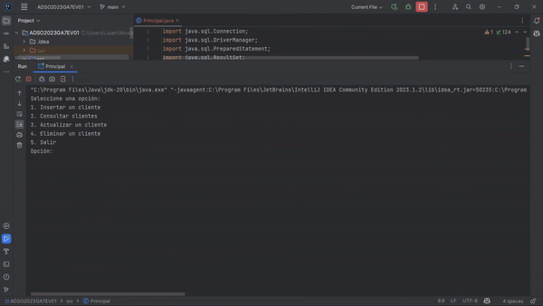

# GA7-220501096-AA2-EV01

## Introducción

Este repositorio contiene una aplicación Java que se conecta a una base de datos SQL para realizar operaciones básicas de gestión de datos. La aplicación proporciona funcionalidades de inserción, consulta, actualización y eliminación de registros en la base de datos.


La aplicación ha sido desarrollada como parte de la Evidencia del SENA  y está diseñada para proporcionar una solución eficiente en la gestión de clientes para una asesoría financiera. Las funciones de la aplicación permiten agregar nuevos clientes, consultar información específica, actualizar datos existentes y eliminar registros.

La asesoría de gestión de clientes para asesoría financiera se beneficia de esta aplicación, ya que brinda una herramienta eficaz para el seguimiento y administración de los clientes. Con la capacidad de realizar operaciones de inserción, consulta, actualización y eliminación, la aplicación facilita la gestión de datos y permite un acceso rápido y sencillo a la información relevante.

La aplicación se enfoca en la eficiencia y organización de las tareas relacionadas con el seguimiento y asesoramiento de los clientes, contribuyendo así al éxito y crecimiento de la asesoría financiera.



# Aplicación de Gestión de Clientes de Asesoría Financiera

Esta aplicación Java proporciona una solución para manejar los datos de los clientes de un emprendimiento de asesoría financiera. Permite realizar operaciones CRUD (Crear, Leer, Actualizar y Eliminar) sobre la información de los clientes de manera sencilla y eficiente.

## Características principales

- **Crear cliente:** Agregar un nuevo cliente a la base de datos del emprendimiento financiero, capturando su información personal.
- **Consultar clientes:** Obtener una lista de todos los clientes registrados en el emprendimiento financiero, mostrando su información completa.
- **Actualizar cliente:** Modificar los datos de un cliente existente.
- **Eliminar cliente:** Eliminar un cliente de la base de datos del emprendimiento financiero.
- **Interfaz de línea de comandos (CLI):** La aplicación se ejecuta desde la línea de comandos, proporcionando una interfaz sencilla e intuitiva para interactuar con ella.

## Requisitos previos

Antes de utilizar esta aplicación, asegúrate de tener instalados los componentes necesarios en tu entorno de desarrollo.

## Configuración

Antes de ejecutar la aplicación, asegúrate de realizar los siguientes pasos de configuración:

1. **Configurar la base de datos:** Crea una base de datos en tu sistema de gestión de bases de datos para almacenar los datos de los clientes.

2. **Actualizar la configuración de conexión:** Actualiza la información de conexión en el archivo de configuración para que coincida con tu entorno.

## Uso

Sigue los pasos a continuación para utilizar la aplicación:

1. Abre la línea de comandos en tu sistema.

2. Navega hasta el directorio donde se encuentra la aplicación.

3. Compila el código fuente de la aplicación Java ejecutando el comando de compilación correspondiente.

4. Ejecuta la aplicación con el comando de ejecución correspondiente.

5. Sigue las instrucciones en pantalla para interactuar con la aplicación y realizar operaciones en los datos de los clientes.

# Creación de la tabla "clientes" en MySQL Workbench

Para poder utilizar la aplicación, es imprescindible llevar a cabo la creación de la tabla "clientes" en una base de datos MySQL. A continuación, se proporcionan las instrucciones detalladas para llevar a cabo este proceso utilizando MySQL Workbench:

1. Inicia MySQL Workbench y establece la conexión con el servidor de la base de datos.

2. Dirígete a la pestaña "SQL Editor" y procede a redactar el siguiente código SQL:

   ```sql
   CREATE TABLE clientes (
     id INT AUTO_INCREMENT PRIMARY KEY,
     nombres_apellidos VARCHAR(100) NOT NULL,
     edad INT,
     correo_electronico VARCHAR(100) NOT NULL,
     tipo_emprendimiento VARCHAR(100),
     fecha_cumpleaños DATE
   );
   ```

3. Para ejecutar el script SQL, selecciona el botón "Ejecutar" o presiona la combinación de teclas "Ctrl+Shift+Enter".

4. Una vez ejecutado el script, la tabla "clientes" se creará en la base de datos especificada. A partir de este momento, podrás utilizar la aplicación Java para administrar los registros de los clientes.


# Creación de base de datos y tabla con un sistema de gestión de bases de datos en MariaDB

Aquí encontrarás los pasos necesarios para crear una base de datos y una tabla utilizando un sistema de gestión de bases de datos desde la línea de comandos.

## Pasos

1. Abre la línea de comandos ejecutando el siguiente comando:
   ```shell
   mysql -u tu_usuario -p
   ```
   Reemplaza "tu_usuario" con tu nombre de usuario de MariaDB. Presiona Enter y se te pedirá ingresar la contraseña correspondiente.


2. Inicia sesión en el sistema de gestión de bases de datos ejecutando el comando correspondiente.

3. Crea la base de datos ejecutando el comando adecuado (se sugiere MariaDB).
```sql
   CREATE DATABASE asesoria_financiera;
   ```

4. Selecciona la base de datos recién creada para comenzar a trabajar con ella:
   ```sql
   USE asesoria_financiera;
   ```

5. Crea la tabla con las columnas especificadas utilizando el comando correspondiente:
```sql
   CREATE TABLE clientes (
     id INT AUTO_INCREMENT PRIMARY KEY,
     nombres_apellidos VARCHAR(100) NOT NULL,
     edad INT,
     correo_electronico VARCHAR(100) NOT NULL,
     tipo_emprendimiento VARCHAR(100),
     fecha_cumpleaños DATE
   );
   ```

Una vez completados estos pasos, la base de datos y la tabla estarán creadas y listas para su uso en tu proyecto.

¡Listo! Ahora tienes la base de datos y tabla creadas para utilizar en tu proyecto.


## Contribuciones

¡Las contribuciones son bienvenidas! Si deseas contribuir a esta aplicación de gestión de clientes de asesoría financiera, puedes enviar tus cambios mediante una solicitud de pull. Asegúrate de seguir las mejores prácticas de desarrollo y proporcionar una descripción clara de tus cambios.

## Licencia

Esta aplicación se distribuye bajo la [Licencia MIT](LICENSE). Si utilizas este código, te agradeceríamos que incluyas una atribución adecuada mencionando a los autores originales.